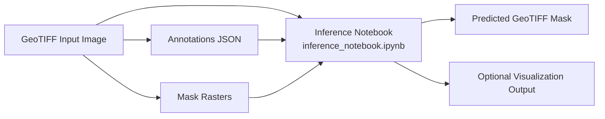

# Team Members
- CS25M103 - Govind Kumar Singh
- CS25M121 - Vraj Patel
- CS25M113 - Priyanshu Verma
- CS25M116 - Ravee Mishra

  
# Geo-Spatial-Segmentation

This repository contains a Mask2Former-based geospatial segmentation workflow for GeoTIFF imagery, where the main deliverable takes TIFF input images and exports predicted masks as GeoTIFF output files.

## Architecture Overview



### Component View
- Data Inputs: GeoTIFF images, (For testing : annotation JSON files, optional mask rasters).
- Inference: notebook for TIFF input to GeoTIFF mask output.
- Visualization: per-image overlay of input image with GT(Ground Truth) and predicted mask.
- Future extension: large-image tiling and stitched GeoTIFF reconstruction.

## Primary Deliverable
The main deliverable is:
- the main inference notebook `inference_notebook.ipynb`

The trained model artifact is:
- `mask2former-best-fresh`

## Model Weights Access (Google Drive)
The trained model folder is large and may exceed GitHub size limits, so model weights are shared via Google Drive.

- Google Drive link: [Google Drive Folder](https://drive.google.com/drive/folders/12hKH-ibkor8TKzERF5agU9z3bnrH0rW1?usp=drive_link)
- Download the model folder and keep the folder name as `mask2former-best-fresh`.
- Place it in your working directory (or any path you prefer) and set `MODEL_DIR` in the inference notebook accordingly.

The submission notebook for patch generation is:
- `generate_geospatial_patches_submission.ipynb`

The class Mapping file :
- `class_mappings.json`

It supports:
- loading a trained model and class mappings,
- GeoTIFF input inference,
- GeoTIFF mask export,
- consistent class-wise visualization for GT and predictions,
- annotation-based GT mask reconstruction for display.

## Repository Files
- `inference_notebook.ipynb`: inference + visualization + GeoTIFF mask export.
- `Geospacial.ipynb`: original training notebook (4-channel Mask2Former, 1024 workflow).
- `generate_geospatial_patches_submission.ipynb`: notebook for geospatial patch/submission preparation.
- `mask2former-best-fresh`: trained model directory exported from `Geospacial.ipynb`.
- `class_mappings.json`: id2label/label2id mapping used by model.

## Data Layout
Expected folder structure for inference:

```text
<dataset_root>/
  images/
    *.tif
  masks/
    *.tif                # optional if annotations are available
  annotations/
    *.json               # optional, used for GT display
```

Expected model artifact structure:

```text
<model_root>/
  mask2former-best-fresh/
    config.json
    preprocessor_config.json
    model.safetensors (or pytorch_model.bin)
    ...
  class_mappings.json
```

## Environment Setup (Local)
Recommended setup:
- Python 3.10 or 3.11
- pip 24.x or newer
- PyTorch 2.3.x
- torchvision 0.18.x
- transformers 4.41.x or newer

If you are using CUDA locally, install PyTorch from the official PyTorch index that matches your CUDA version first, then install the remaining packages.

1. Create virtual environment.

```bash
python -m venv .venv
```

2. Activate virtual environment.

Windows PowerShell:
```powershell
.\.venv\Scripts\Activate.ps1
```

Linux/macOS:
```bash
source .venv/bin/activate
```

3. Upgrade pip and install PyTorch first.

```bash
python -m pip install --upgrade pip
pip install torch torchvision --index-url https://download.pytorch.org/whl/cu121
```

If your machine uses a different CUDA version, replace the index URL with the one from the PyTorch installation guide. If you are on CPU only, use the CPU wheel index instead.

4. Install the remaining dependencies.

```bash
pip install -r requirements.txt
```

Suggested package versions for the notebook runtime:

```text
numpy==1.26.4
matplotlib==3.8.4
rasterio==1.3.10
opencv-python-headless==4.9.0.80
transformers==4.41.2
accelerate==0.31.0
datasets==2.20.0
evaluate==0.4.2
albumentations==1.4.10
```

Notes:
- `torch` and `torchvision` should be installed separately so the wheel matches your Python and CUDA version.
- Kaggle usually already provides a compatible PyTorch runtime, so only the other packages may be needed there.

## Environment Setup (Notebook Runtime)
In a notebook cell, install the local requirements file:

```python
!pip install -r requirements.txt
```

If rasterio/OpenCV are already present in your notebook environment, this may be skipped.

## How To Run the Deliverable Notebook
Open the main inference notebook and run cells in order.

1. Imports cell.
2. Path/config cell:
   - set `MODEL_DIR`
   - set `CLASS_MAP_PATH`
  - set `IMAGE_DIR`, `MASK_DIR`, `ANN_DIR`
  - set `OUTPUT_PRED_DIR` for GeoTIFF outputs
  - keep `USE_ANNOTATIONS_FOR_GT = True` when annotation JSON is available
3. Helpers cell.
4. Model loading cell.
5. Image collection cell.
6. Inference + visualization cell.
7. Optional dataset-wide evaluation cell if you still want a quick internal check.

## Important Notes
- GT source priority is:
  1) annotation JSON (when enabled and available),
  2) mask raster fallback.
- Class-color consistency is deterministic and class-wise (same class -> same color in GT and prediction).
- Predicted masks are exported as GeoTIFF files using the source image georeference.

## Future Work
Large raster inference is planned as future work.

Planned workflow:
- split big GeoTIFF into 1024x1024 tiles,
- use a sliding window with stride 512,
- run tile-wise inference,
- stitch the tile GeoTIFF masks back into one full-scene GeoTIFF.

## Annotation and Class Mapping Rules
- Annotation objects are converted to semantic classes using:
  - `class_name`
  - class-specific attributes:
    - road -> `road_type`
    - builtup -> `roof_type`
    - water -> `water_type`
- Class string format:
  - `<base_class>_type_<fine_type>`
- This must match `label2id` entries from `class_mappings.json`.

## CRS/Geo Alignment Requirements
- Use georeferenced TIFFs (with valid affine transform).
- Annotation coordinates are rasterized using inverse affine transform from each image TIFF.

## Results and Visualizations

Add your result figures in a folder such as `docs/images/` and update the file names below.

### Training Curves

#### Training and Validation Loss


#### IoU / mIoU Result


### Output Images from Test Dataset


